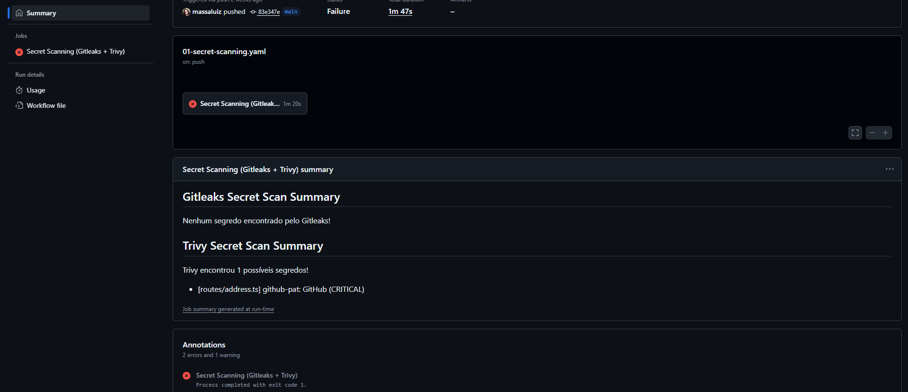
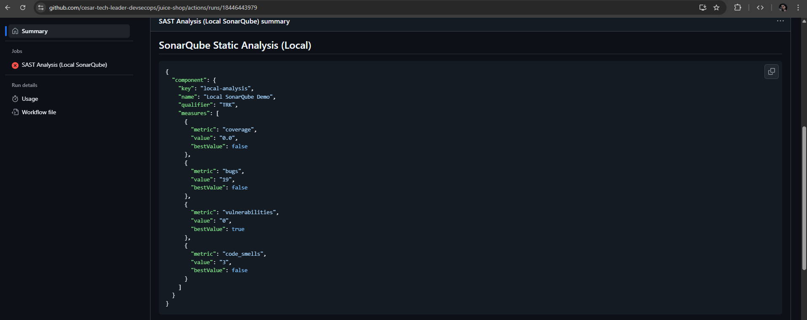
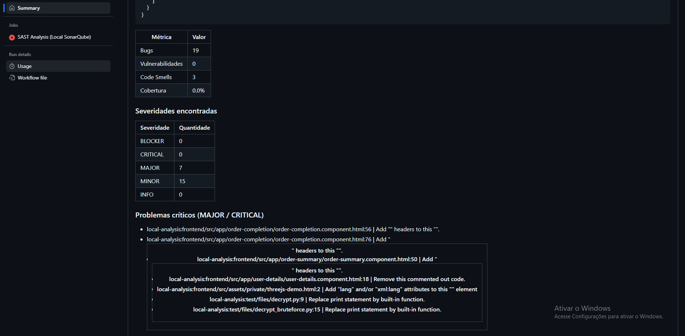
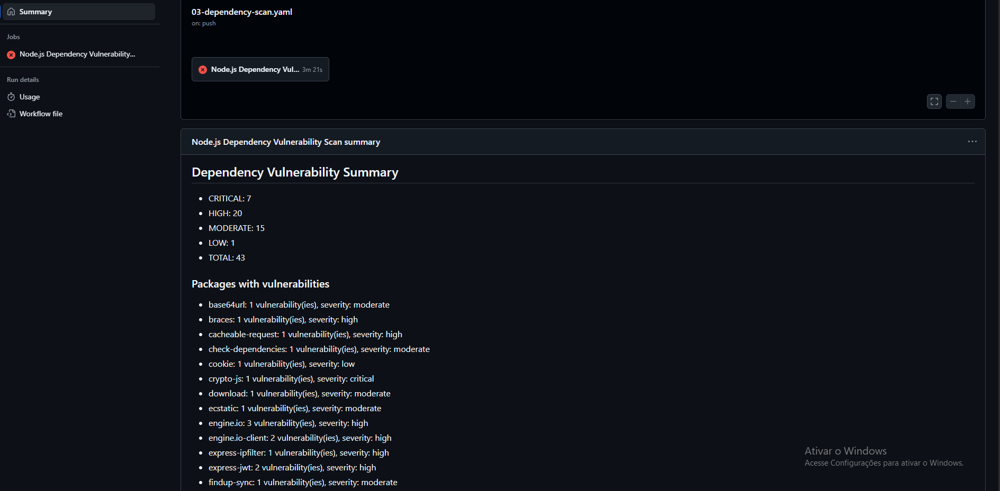

# Relatórios de Ferramentas de Segurança

Este documento consolida as **evidências visuais dos scans de segurança** realizados no projeto.
Cada seção apresenta os resultados das ferramentas executadas nas pipelines CI/CD:

- **01-Secret-Scanning.yml** → Detecção de segredos expostos
- **02-SonarQube.yml** → Análise SAST de código-fonte
- **03-Dependency-Scan.yml** → Verificação de vulnerabilidades em dependências

---

## 01 - Secret Scanning (Gitleaks / Trivy)

### Descrição

Pipeline responsável por identificar **segredos sensíveis** expostos no código ou histórico do repositório.

**Ferramentas utilizadas:**

- [Gitleaks](https://github.com/gitleaks/gitleaks)
- [Trivy](https://aquasecurity.github.io/trivy)

**Critérios de falha:**

- Qualquer segredo identificado (chaves, tokens, senhas, etc.) resulta em falha no job.

---

### Evidências da Execução

#### 🔹 Saída do Gitleaks/Trivy

---

## 02 - SonarQube (SAST)

### Descrição

Pipeline responsável pela **análise estática do código-fonte** (SAST) para identificar vulnerabilidades, code smells e problemas de qualidade.

**Ferramenta utilizada:**

- [SonarQube](https://www.sonarqube.org/)

**Critérios de falha:**

- Vulnerabilidades **High ou Critical**.
- Cobertura de testes < 60%.
- Bugs classificados como **MAJOR ou CRITICAL**.

---

### Evidências da Execução

#### 🔹 Print 1 — Execução da pipeline

---

## 03 - Dependency Scan (npm audit / Trivy SBOM)

### Descrição

Pipeline responsável por detectar vulnerabilidades em dependências Node.js.
A análise é feita **diretamente no `package.json`**, sem necessidade de instalação.

**Ferramentas utilizadas:**

- `npm audit`
- [Trivy](https://aquasecurity.github.io/trivy) (para geração opcional de SBOM)

**Critérios de falha:**

- Qualquer vulnerabilidade **High ou Critical**.

---

### Evidências da Execução

#### 🔹 Print 1 — Execução da pipeline

---

## Conclusão

Essas evidências demonstram que:

- O repositório implementa **pipelines de segurança automatizadas**.
- As ferramentas **detectam vulnerabilidades reais** e impedem merges inseguros.
- O processo segue o conceito de **DevSecOps e Shift-Left Security**, antecipando falhas ainda na fase de desenvolvimento.
